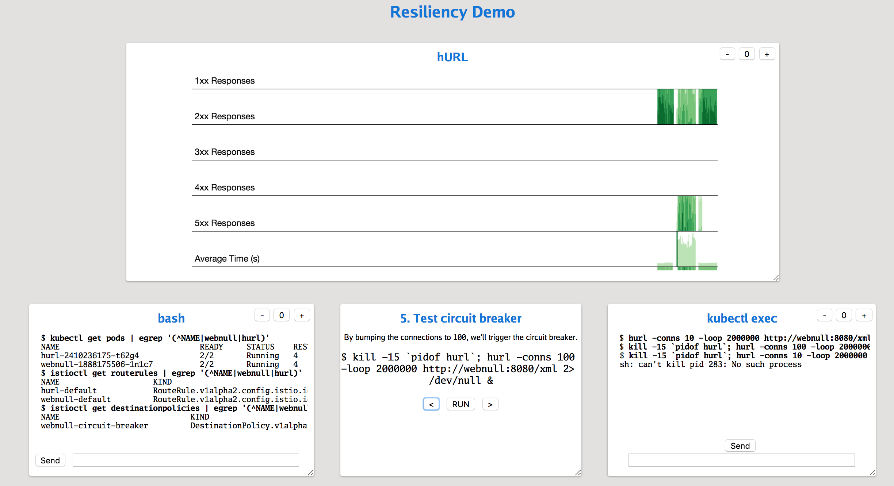
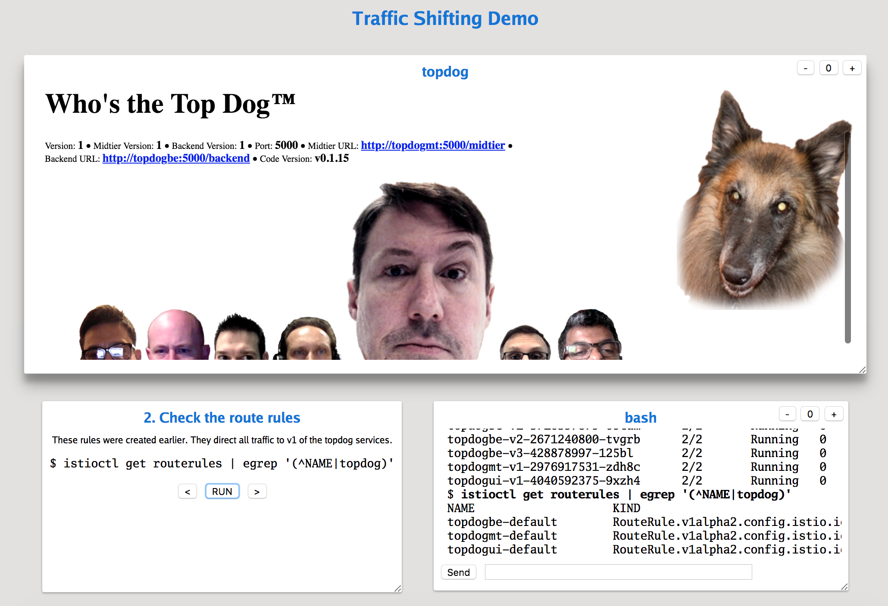

# istio-talk

This repository contains demo code for my talk on [Istio].

## Resiliency Demo

See the [walk-through](resiliency/README.md).

To use my [demo tool], follow the setup instructions in the [walk-through](resiliency/README.md) and then run [startDemo.sh](resiliency/startDemo.sh) from the `resiliency` folder.

## Traffic Shifting Demo

See the [walk-through](trafficshifting/README.md).

To use my [demo tool], follow the setup instructions in the [walk-through](trafficshifting/README.md) and then run [startDemo.sh](trafficshifting/startDemo.sh) from the `trafficshifting` folder.

## Notes

These demos use other utilities I've created:

* [topdog], a demo application written in Go. Also see the [topdog Docker image].
* [webnull], a service that tosses away requests and graphs throughput. Also see the [webnull Docker image].
* [hurl], a cURL-like application designed to send many parallel HTTP requests to generate load. Also see the [hURL Docker image].
* [demon], a utility for showing the demos on one unified web page.

[Istio]: https://istio.io/
[topdog]: https://github.com/ancientlore/topdog
[hURL]: https://github.com/ancientlore/hurl
[webnull]: https://github.com/ancientlore/webnull
[topdog Docker image]: https://hub.docker.com/r/ancientlore/topdog/
[webnull Docker image]: https://hub.docker.com/r/ancientlore/webnull/
[hURL Docker image]: https://hub.docker.com/r/ancientlore/hurl/
[demon]: https://github.com/ancientlore/demon
[demo tool]: https://github.com/ancientlore/demon
