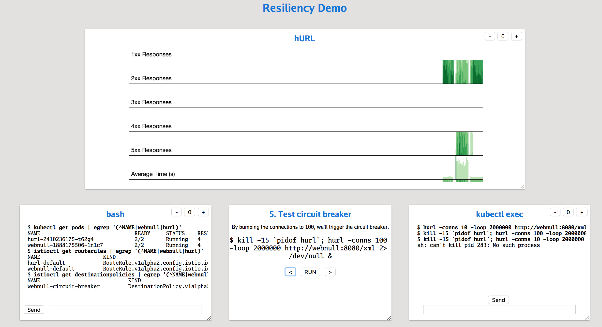
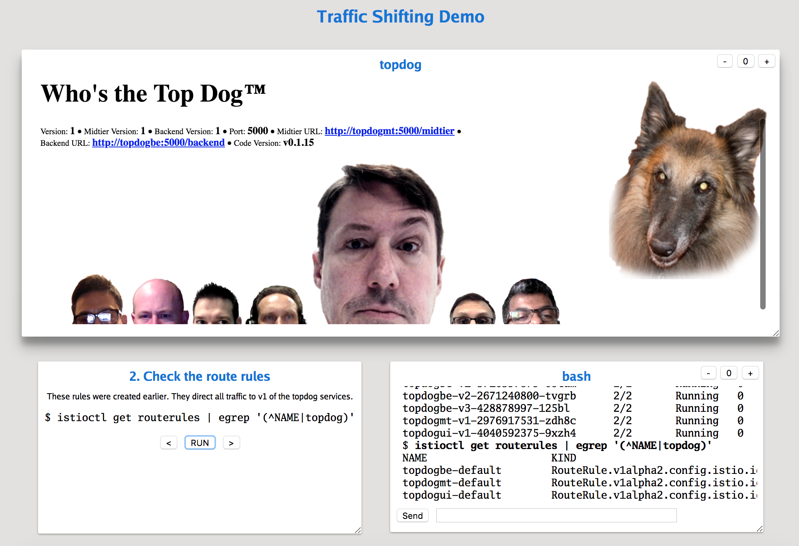

# istio-talk

This repository contains demo code for my talk on [Istio].

To view the slides, run Go's [present](https://godoc.org/golang.org/x/tools/present) tool from the project folder and select `istio-talk.slide`.

## Resiliency Demo

See the [walk-through](resiliency/README.md).

To use my [demo tool], follow the setup instructions in the [walk-through](resiliency/README.md) and then run [startDemo.sh](resiliency/startDemo.sh) from the `resiliency` folder.

## Traffic Shifting Demo

See the [walk-through](trafficshifting/README.md).

To use my [demo tool], follow the setup instructions in the [walk-through](trafficshifting/README.md) and then run [startDemo.sh](trafficshifting/startDemo.sh) from the `trafficshifting` folder.

## Vagrant Version

I've created a Vagrant version to make it easy to spin up an environment for running the demos. Pull this repository and then `vagrant up` and `vagrant ssh`. Then run the demo script from inside the box:

    /vagrant/vagrant-demo.sh

This will start the `present` tool on http://192.168.99.101:8080/ and the first demo (traffic shifting) on http://192.168.99.101:8081/. After showing the first demo, press return and the second demo (resiliency) will start on the same port. Press return again and the demo and `present` should stop.

The Vagrant version also has the Istio tools available at:

* http://jaeger.192.168.99.101.xip.io/zipkin
* http://zipkin.192.168.99.101.xip.io/zipkin
* http://grafana.192.168.99.101.xip.io/
* http://servicegraph.192.168.99.101.xip.io/dotviz

And the demo pods can be reached directly at:

* http://topdog.192.168.99.101.xip.io/
* http://hurl.192.168.99.101.xip.io/
* http://webnull.192.168.99.101.xip.io/status

## Docker for Desktop Version

If you have Docker for Desktop, you can enable Kubernetes and then [install Istio](https://istio.io/docs/setup/kubernetes/quick-start/). You will also need to [install Go](https://golang.org/doc/install), making sure it's on your path.

Install the Go tools as well:

    go get golang.org/x/tools/cmd/present
    git clone https://github.com/ancientlore/demon
    cd demon && go install && cd -
    rm -rf demon

The following script will set up the demos:

    ./docker/setup.sh

Then run `demo.sh` to start the demo.

The Docker version also has the Istio tools available at:

* http://jaeger.127.0.0.1.xip.io/zipkin
* http://zipkin.127.0.0.1.xip.io/zipkin
* http://grafana.127.0.0.1.xip.io/
* http://servicegraph.127.0.0.1.xip.io/dotviz

And the demo pods can be reached directly at:

* http://topdog.127.0.0.1.xip.io/
* http://hurl.127.0.0.1.xip.io/
* http://webnull.127.0.0.1.xip.io/status

## Notes

These demos use other utilities I've created:

* [topdog], a demo application written in Go. Also see the [topdog Docker image].
* [webnull], a service that tosses away requests and graphs throughput. Also see the [webnull Docker image].
* [hurl], a cURL-like application designed to send many parallel HTTP requests to generate load. Also see the [hURL Docker image].
* [demon], a utility for showing the demos on one unified web page.

[Istio]: https://istio.io/
[topdog]: https://github.com/ancientlore/topdog
[hURL]: https://github.com/ancientlore/hurl
[webnull]: https://github.com/ancientlore/webnull
[topdog Docker image]: https://hub.docker.com/r/ancientlore/topdog/
[webnull Docker image]: https://hub.docker.com/r/ancientlore/webnull/
[hURL Docker image]: https://hub.docker.com/r/ancientlore/hurl/
[demon]: https://github.com/ancientlore/demon
[demo tool]: https://github.com/ancientlore/demon
