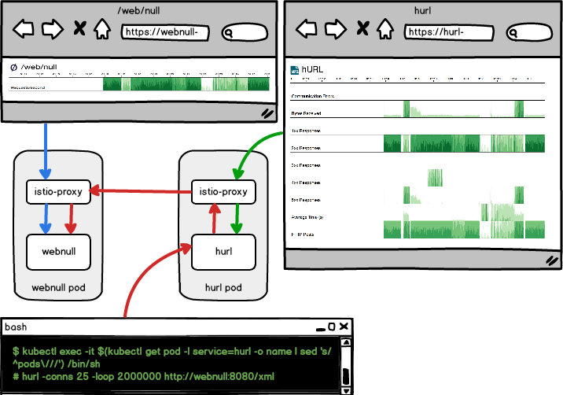
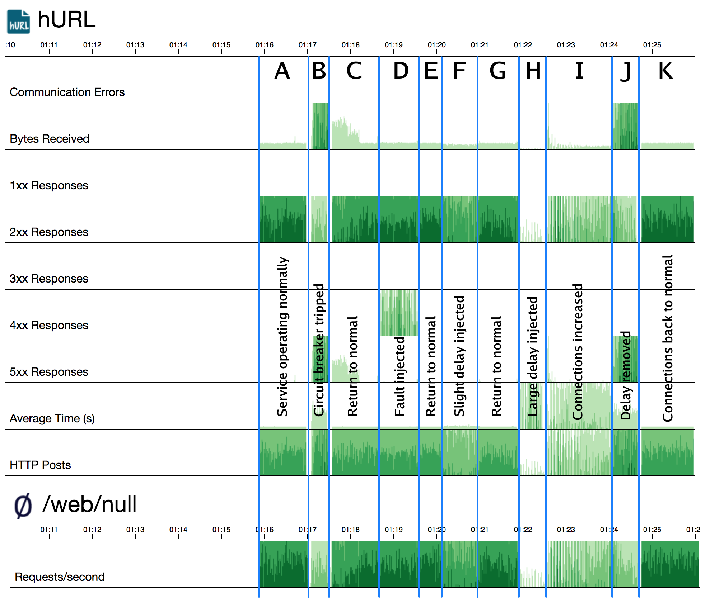

# Resiliency Demo using Istio

This demo shows a mock service, [webnull], that just throws away requests. Another mock service, [hurl], is really a tool to send parallel HTTP requests to [webnull] to simulate load. We will use [Istio] to test circuit breakers, inject faults, and inject delays. These tools can be used to test how upsteam services respond to problems.

What is great about [Istio] is that these functions are part of the _infrastructure_ - no special coding is needed in [hurl] or [webnull] to take advantage of these features. [Istio] also has a great dashboard, a service graph, and a trace analyzer.

> Note: These instructions assume a `bash` shell. On Windows, you can use `git-bash` which should be installed with [git](https://git-scm.com/).

## Requirements

For this demo you need:

* A Kubernetes cluster (or [Minikube]) with [Istio] installed.
* The [kubectl command](https://kubernetes.io/docs/tasks/tools/install-kubectl/) should be installed.
* Optionally, the [istioctl command](https://istio.io/docs/reference/commands/istioctl) can be used.

## Setup

Export the following variables which are used by the commands in this demo:

* `KUBE_NAMESPACE` - The Kubernetes namespace to deploy to (like `default`, but use yours).

> Note: Export a variable using, for example, `export KUBE_NAMESPACE=my-kubernetes-namespace`, or assign it when calling the script like `KUBE_NAMESPACE=my-kubernetes-namespace ./script.sh`.

Deploy [webnull] according to its [instructions](webnull/README.md). Then deploy [hurl] according to its [instructions](hurl/README.md). Be sure to install the version that injects the [Istio] sidecar.

> Note: The [hurl] user interface will not be available until the `hurl` command is running inside the container.

Make sure the containers are running:

    $ kubectl get pods
    NAME                              READY     STATUS    RESTARTS   AGE
    hurl-4211406881-d8rz5             2/2       Running   0          1m
    webnull-3334364612-nlwsr          2/2       Running   0          1m

Set up the route rules for each service, and the circuit breaker destination policy:

    $ cd istio
    $ istioctl create -f route-rule.yaml -n $KUBE_NAMESPACE
    $ istioctl create -f circuit-breaker.yaml -n $KUBE_NAMESPACE

> Note that you can generally use `kubectl` instead of `istioctl`, but `istioctl` provides additional client-side validation.

You can check the route rules using `istioctl get routerules` or `kubectl get routerules`. You can also fetch an individual rule using:

    $ istioctl get routerule webnull-default -n $KUBE_NAMESPACE -o yaml
    $ istioctl get routerule hurl-default -n $KUBE_NAMESPACE -o yaml

Similarly, you can get destination policies using `istioctl get destinationpolicies` or fetch an individual one:

    $ istioctl get destinationpolicy webnull-circuit-breaker -n $KUBE_NAMESPACE -o yaml

You're now ready to proceed with the demo.

## Starting the Demo

Start [hurl] with a basic request set.

    $ kubectl exec -it $(kubectl get pod -l app=hurl -o name | sed 's/^pods\///') /bin/sh
    # hurl -conns 10 -loop 2000000 http://webnull:8080/xml

> Stay logged into the [hurl] container so that you can exercise commands later. In this walk-through, commands shown with `#` are executed in the hurl container, and commands shown with `$` are executed in your normal shell.

Look at the [webnull] dashboard by running the command below (in a new shell) and browsing to http://localhost:8081/status/ - it shows incoming request volume and bytes received if it was a POST or PUT. This small utility can be used to check what sort of throughput you could achieve, assuming your service had no actual work to do.

    $ kubectl port-forward $(kubectl get pod -l app=webnull -o name | sed 's/^pods\///') 8081:8080

Now look at the [hurl] dashboard by running the command below (in a new shell) and browsing to http://localhost:8082/. [hurl] was created to work similarly to [curl], except that it sends requests in parallel to load up some other service. The dashboard shows graphs of response codes, bytes recieved, and request round-trip time.

    $ kubectl port-forward $(kubectl get pod -l app=hurl -o name | sed 's/^pods\///') 8082:8080

We will be using [hurl] to send load to [webnull], and then checking what happens when we exercise [Istio] features.

> Note: Run the [Istio] commands from the `istio` folder.

We have already set up a [default routerule](istio/route-rule.yaml) in [Istio]:

    $ istioctl get routerule webnull-default -n $KUBE_NAMESPACE -o yaml

Also, we have a [circuit breaker](istio/circuit-breaker.yaml) set up:

    $ istioctl get destinationpolicy webnull-circuit-breaker -n $KUBE_NAMESPACE -o yaml

At this point, the service is "operating normally".

> See region A on the diagram below

## Circuit Breaker

To trigger the circuit breaker, restart [hurl] with more connections:

    # hurl -conns 100 -loop 2000000 http://webnull:8080/xml 

Note the large number of HTTP 503 responses from the circuit breaker.

> See region B on the diagram below

Now restart [hurl] with a normal number of connections.

    # hurl -conns 10 -loop 2000000 http://webnull:8080/xml

Things return to normal, although [Istio] may still have the circuit breaker triggered.

> See region C on the diagram below

## Fault Injection

Next, we will inject [faults](istio/inject-abort.yaml) into the system.

    $ istioctl create -f inject-abort.yaml -n $KUBE_NAMESPACE

Note the HTTP 400 responses from the fault. This can be used to test how upstream services respond to failures.

> See region D on the diagram below

Now remove the fault:

    $ istioctl delete routerule webnull-test-abort -n $KUBE_NAMESPACE

Note how the service returns to normal.

> See region E on the diagram below

## Delay Injection

We will now inject a [small delay](istio/inject-delay.yaml) into some percentage of the requests.

    $ istioctl create -f inject-delay.yaml -n $KUBE_NAMESPACE

Note that even with this small delay, the service doesn't process as many transactions.

> See region F on the diagram below

Remove the small delay:

    $ istioctl delete routerule webnull-test-delay -n $KUBE_NAMESPACE

Note the service return to normal.

> See region G on the diagram below

## Big Delay Injection

Now let's inject a [larger delay](istio/inject-big-delay.yaml) on more requests, simulating a potential database performance issue.

    $ istioctl create -f inject-big-delay.yaml -n $KUBE_NAMESPACE

Note how the service practically falls over.

> See region H on the diagram below

But to be realistic, let's add far more connections to similate requests from clients piling up.

    # hurl -conns 100 -loop 2000000 http://webnull:8080/xml 

Note that the service improves, but is still hurting. In some cases it might also trigger the circuit breaker.

> See region I on the diagram below

"Fix the database" and remove the delay.

    $ istioctl delete routerule webnull-test-bigdelay -n $KUBE_NAMESPACE

Now the circuit breaker is triggering - why? The reason is that we still have many requests going.

> See region J on the diagram below

 In reality the request rate would come back under control once the service speeds up, so let's adjust [hurl] for that.

    # hurl -conns 10 -loop 2000000 http://webnull:8080/xml

The circuit breaker has a memory and still may trigger, but things are getting back to normal.

> See region K on the diagram below

## Request Timeouts

To test request timeouts, first try a long-running page without a timeout in place:

    # hurl http://webnull:8080/delay/5000

Next, set up the [request timeout](istio/request-timeout.yaml) route rule.

    $ istioctl create -f request-timeout.yaml -n $KUBE_NAMESPACE

Wait a moment for the Istio proxy to update, then try the request again:

    # hurl http://webnull:8080/delay/5000
    2018/01/25 21:47:47 Failed to post to http://webnull:8080/delay/5000, status 504 Gateway Timeout

Clean up the rule:

    $ istioctl delete routerule webnull-request-timeout -n $KUBE_NAMESPACE

## Diagram

## Closing Thoughts

* [Istio] takes several problems that used to be (inconsistently implemented) coding exercises and makes them a consistent part of the infrastructure.
* Testing upstream service behavior is easily accomplished by injecting faults and delays.
* Circuit breakers can use used to protect upstream (and downtream) services from overload.
* HTTP timeouts are easily controlled, even when the service implementations don't set them explicitly.
* [Istio] can be extended to services outside of Kubernetes.
* [Istio] includes much more, including mutual TLS between services, throttling, and monitoring.

[webnull]: https://github.com/ancientlore/webnull
[hurl]: https://github.com/ancientlore/hurl
[Istio]: https://istio.io/
[curl]: https://curl.haxx.se/
