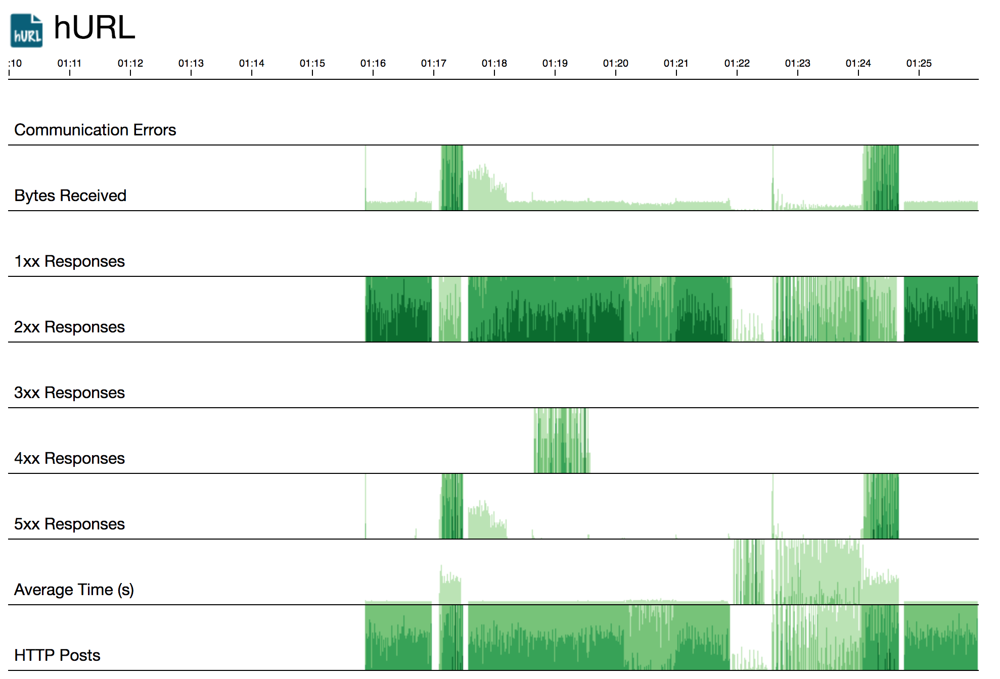

# hurl

"[hurl] in a container."

[hurl] is an open-source utility that works a lot like [curl], except that it is designed for pulling many requests concurrently. As such, it's also ideal for easily generating load on servers. It includes a graph that shows informtation about the requests going on.

> Note: These instructions assume a `bash` shell. On Windows, you can use `git-bash` which should be installed with [git](https://git-scm.com/).

## Usage

To use the [hurl] container you need to `exec` into it using `kubectl`.

    $ kubectl exec -it $(kubectl get pod -l service=hurl -o name | sed 's/^pods\///') /bin/sh

You then use [hurl] with the appropriate command-line options.

        __    __  ______  __ 
       / /_  / / / / __ \/ / 
      / __ \/ / / / /_/ / /  
     / / / / /_/ / _, _/ /___
    /_/ /_/\____/_/ |_/_____/

    A tool to fetch over HTTP, slanted towards load generation.

    Usage:
    hurl [options] url1 [url2 ... urlN]
    hurl [options] @urlFile

    Example:
    hurl -method POST -files "*.xml" -conns 10 http://localhost/svc/foo http://localhost/svc/bar
    hurl -method POST -files "*.xml" -conns 10 @urls.txt

    Options:
    -addr string
            HTTP service address for monitoring. (default ":8080")
    -conns int
            Number of concurrent HTTP connections. (default 2)
    -cpu int
            Number of CPUs to use.
    -cpuprofile string
            Write CPU profile to given file.
    -discard
            Discard received data.
    -files string
            Pattern of files to post, like *.xml. Comma-separate for multiple patterns.
    -hdrdelim string
            Delimiter for HTTP headers specified with -header. (default "|")
    -headers string
            HTTP headers, delimited by -hdrdelim.
    -help
            Show help.
    -loop int
            Number of times to loop and repeat. (default 1)
    -memprofile string
            Write memory profile to given file.
    -method string
            HTTP method. (default "GET")
    -nocompress
            Disable HTTP compression.
    -nokeepalive
            Disable HTTP keep-alives.
    -requestid string
            Name of header to send a random GUID.
    -timeout duration
            HTTP timeout. (default 10s)
    -version
            Show version.
    -wd string
            Set the working directory.

    All of the options can be set via environment variables prefixed with "HURL_" - for instance,
    HURL_TIMEOUT can be set to "30s" to increase the default timeout.

    Options can also be specified in a TOML configuration file named "hurl.config". The location
    of the file can be overridden with the HURL_CONFIG environment variable.

In our tests, we'll typically use [hurl] to talk to the [webnull] container as follows:

    # hurl -conns 25 -loop 2000000 http://webnull:8080/xml

> NOTE: Normally [hurl] does not discard responses. Inside the container, `HURL_DISCARD` is set to `true`, causing it to discard results by default. This makes the command-line options simpler, since we're only trying to induce load.

## Deployment

To deploy the [hurl] container without [Istio], run:

    $ kubectl apply -f ./kube/

To deploy the [hurl] container with [Istio], run:

    $ kubectl apply -f <(~istioctl kube-inject -f ./kube/)

You can check the UI by using a port-forward and then browsing to http://localhost:8082/.

    $ hp=`kubectl get pod -l service=hurl -o name | sed 's/^pods\///'`
    $ kubectl port-forward $hp 8082:8080

[hurl]: https://github.com/ancientlore/hurl
[curl]: https://curl.haxx.se/
[webnull]: https://github.com/ancientlore/webnull
[Istio]: https://istio.io/
