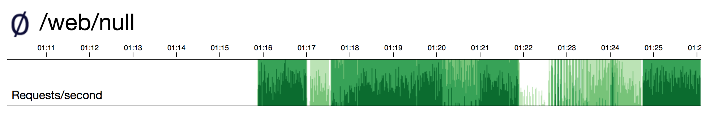

# webnull

This project deploys an instance of a [webnull] container for testing.

[webnull] is an open source project that accepts requests and throws them away. It's like a simpler version of [httpbin], and it has a graph to view requests.

By using [webnull], you can test networks or connectivity.

> Note: These instructions assume a `bash` shell. On Windows, you can use `git-bash` which should be installed with [git](https://git-scm.com/).

## Endpoints

* `/status` shows the graph.
* `/delay/NNN` delays the response by `NNN` milliseconds and then returns `200 OK`.
* `/http/NNN` responds with an HTTP `NNN` code.
* Anything else response with `200 OK`.

## Deployment

To deploy the [webnull] container without [Istio] *or* if you have Istio automatic sidecar injection enabled, run:

    $ kubectl apply -f ./kube/deployment.yaml

To deploy the [webnull] container with [Istio] and automatic sidecar injection is not enabled, run:

    $ kubectl apply -f <(istioctl kube-inject -f ./kube/deployment.yaml)

You can check the UI by using a port-forward and then browsing to http://localhost:8081/status.

    $ wp=`kubectl get pod -l app=webnull -o name | sed 's/^pods\///'`
    $ kubectl port-forward $wp 8081:8080

[webnull]: https://github.com/ancientlore/webnull
[httpbin]: http://httpbin.org/
[Istio]: https://istio.io/
