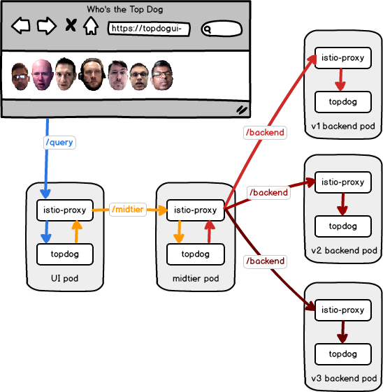

# Traffic Shifting Demo using Istio

This project demonstrates how traffic can be shifted between different versions of a service. It also shows how to retry requests using [Istio].

What is great about [Istio] is that these functions are part of the _infrastructure_ - no special coding is needed to take advantage of these features. [Istio] also has a great dashboard, a service graph, and a trace analyzer.

The demo is based on a simple application called [topdog]. [topdog] has three tiers - a UI, a middle tier, and a backend tier. All three are served the same [Docker] image, for simplicity.

> Note: These instructions assume a `bash` shell. On Windows, you can use `git-bash` which should be installed with [git](https://git-scm.com/).

## Requirements

For this demo you need:

* A Kubernetes cluster (or [Minikube], or [Docker] for Desktop) with [Istio] installed.
* The [kubectl command](https://kubernetes.io/docs/tasks/tools/install-kubectl/) should be installed.
* Optionally, the [istioctl command](https://istio.io/docs/reference/commands/istioctl) can be used.

## Setup

Export the following variables which are used by the commands in this demo:

* `KUBE_NAMESPACE` - The Kubernetes namespace to deploy to (like `default`, but use yours).

> Note: Export a variable using, for example, `export KUBE_NAMESPACE=my-kubernetes-namespace`, or assign it when calling the script like `KUBE_NAMESPACE=my-kubernetes-namespace ./script.sh *.json`.

Deploy [topdog] according to its [instructions](topdog/README.md). Be sure to install the version that injects the [Istio] sidecar.

Make sure the containers are running:

    $ kubectl get pods
    NAME                              READY     STATUS    RESTARTS   AGE
    topdogbe-v1-3067989556-267jm      2/2       Running   0          1m
    topdogbe-v2-1117189381-pt85q      2/2       Running   0          1m
    topdogbe-v3-1436324766-r3jxb      2/2       Running   0          1m
    topdogmt-v1-3844409480-6w4dd      2/2       Running   0          1m
    topdogui-v1-3220263237-8x5ht      2/2       Running   0          1m

> Note that there are three versions of the backend pod, one version of the midtier pod, and one version of the UI pod. Normally we wouldn't create three versions of the backend at the same time.

Set up the virtual services and destination rules for each service:

    $ cd istio
    $ kubectl apply -f services-all-v1.yaml -n $KUBE_NAMESPACE

> Note that you can generally use `kubectl` instead of `istioctl`, but `istioctl` provides additional client-side validation.

You can check the virtual services using `istioctl get virtualservices` or `kubectl get virtualservices`. You can also fetch an individual service using:

    $ kubectl get virtualservice topdogui -n $KUBE_NAMESPACE -o yaml
    $ kubectl get virtualservice topdogmt -n $KUBE_NAMESPACE -o yaml
    $ kubectl get virtualservice topdogbe -n $KUBE_NAMESPACE -o yaml

You can check the destination rules using `istioctl get destinationrules` or `kubectl get destinationrules`. You can also fetch an individual destination rule using:

    $ kubectl get destinationrule topdogui -n $KUBE_NAMESPACE -o yaml
    $ kubectl get destinationrule topdogmt -n $KUBE_NAMESPACE -o yaml
    $ kubectl get destinatiorule topdogbe -n $KUBE_NAMESPACE -o yaml

You're now ready to proceed with the demo.

## Starting the Demo

The [topdog] service has already been deployed, but if you need to deploy it see the [instructions](topdog/README.md).

View the user interface by running the following command (in a new shell) and then browsing to http://localhost:5000/.

    $ kubectl port-forward $(kubectl get pod -l app=topdogui -o name | sed 's/^pods\///') 5000

> Note: Run the [Istio] commands from the [istio](istio) subfolder.

We start out with a [default set of virtual services and destination rules](istio/services-all-v1.yaml) that we created earlier:

    $ kubectl apply -f services-all-v1.yaml -n $KUBE_NAMESPACE

These rules pass all traffic to the `v1` version of the services.

## First Version

The first version works, but the results seem skewed to benefit the original developer.

> Never let a candidate create the voting machine.

Someone on the team decided to fix this. Let's test their version, routing traffic 50/50 between `v1` and `v2`.

    $ kubectl apply -f service-be-v1-v2.yaml -n $KUBE_NAMESPACE

This [virtual service](istio/service-be-v1-v2.yaml) defines weighted routes so that traffic arriving uses both `v1` and `v2`.

## Second Version

The second version fixed the original bug, but it introduced occasional failures. We noticed that retrying the request works. So, we decided to add in retries using [Istio] rather than back out the new service. We can't let the original developer be the top dog.

    $ kubectl apply -f service-mt-retry.yaml -n $KUBE_NAMESPACE

The [retry logic](istio/service-mt-retry.yaml) fixes the problems, so we're going to move all the traffic to `v2` by [replacing the virtual service](istio/service-be-v2.yaml) and deleting the 50/50 rule.
    
    $ kubectl apply -f service-be-v2.yaml -n $KUBE_NAMESPACE

## Third Version

Now another team member decided that we really should fix the problem, even though we have worked around the issue. So let's start moving traffic 50/50 between `v2` and `v3` using a [new route](istio/service-be-v2-v3.yaml).

    $ kubectl apply -f service-be-v2-v3.yaml -n $KUBE_NAMESPACE

That seems to look good, so we'll route all the traffic to `v3` by [replacing the virtual service](istio/service-be-v3.yaml), thus deleting the 50/50 rule.

    $ kubectl apply -f service-be-v3.yaml -n $KUBE_NAMESPACE

Do the results still seem skewed?

[Istio]: https://istio.io/
[topdog]: https://github.com/ancientlore/topdog
[Docker]: https://www.docker.com/
[Minikube]: https://github.com/kubernetes/minikube
