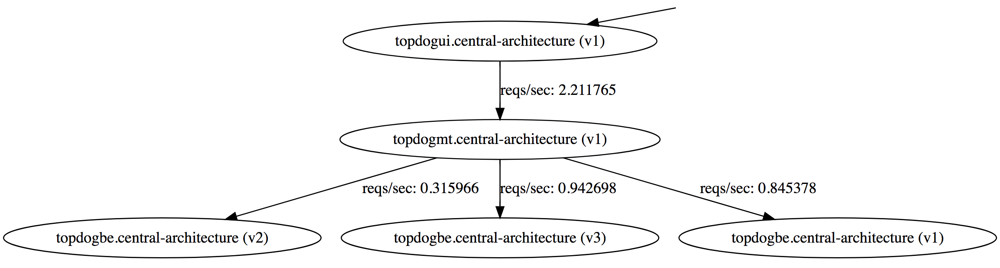

# topdog

This project deploys a QA instance of the [topdog] application for testing.

[topdog] is a simple three-tier application.

* The _backend_ returns random, weighted data about who the "top dog" architect is at any given moment.
* The _midtier_ queries the backend for the "top dog".
* The _UI_ queries the midtier and displays realtime results.

The deployment includes three versions of the backend. Ordinarily, you would not deploy all three at once, but for this demo that works well. The midtier is essentially a pass-through, but in practice could have other business logic.

> Note: Each tier uses the same Docker image. This is just for simplicity.

> Note: These instructions assume a `bash` shell. On Windows, you can use `git-bash` which should be installed with [git](https://git-scm.com/).

## UI Endpoints

* `/` shows the UI.
* `/query` gets the "top dog".
* `/static/*` returns static content.

## Midtier Endpoints

* `/midtier` returns the "top dog" from the midtier, which has to query the backend to get it.

## Backend Endpoints

* `/backend` computes the "top dog" using a random, weighted system.

## Deployment

To deploy the [topdog] container in `awsqa`, export the following environment variables and then run `./deploy.sh *.json | jq .`. (You can omit the `| jq .` if you don't have the `jq` utility. It just formats the output JSON.)

* `KUBE_USER` - The Kubernetes user (defaults to `minikube`).
* `KUBE_TOKEN` - The Kubernetes token.
* `KUBE_NAMESPACE` - The Kubernetes namespace to deploy to (defaults to `default`).
* `KUBE_OWNER` - The owner.

> Note: Export a variable using, for example, `export KUBE_USER=my-kubernetes-user`, or assign it when calling the script like `KUBE_USER=my-kubernetes-user ./deploy.sh`.

### MiniKube Deployment

Make sure you have done `minikube addons enable ingress`.

    $ kubectl config use-context minikube
    $ export token=$(kubectl get secrets $(kubectl get secrets | grep default | grep service-account-token | awk '{print $1}') -o jsonpath='{.data.token}' | base64 -D)
    $ SkipperEndpoint=https://skipper.192.168.99.100.xip.io KUBE_NAMESPACE=default KUBE_TOKEN=$token KUBE_USER="" ./deploy.sh *.json

Then check the UI at https://topdogui-default.192.168.99.100.xip.io/.

## Brought to you by:

[Istio]: https://istio.io/
[topdog]: https://github.com/ancientlore/topdog
